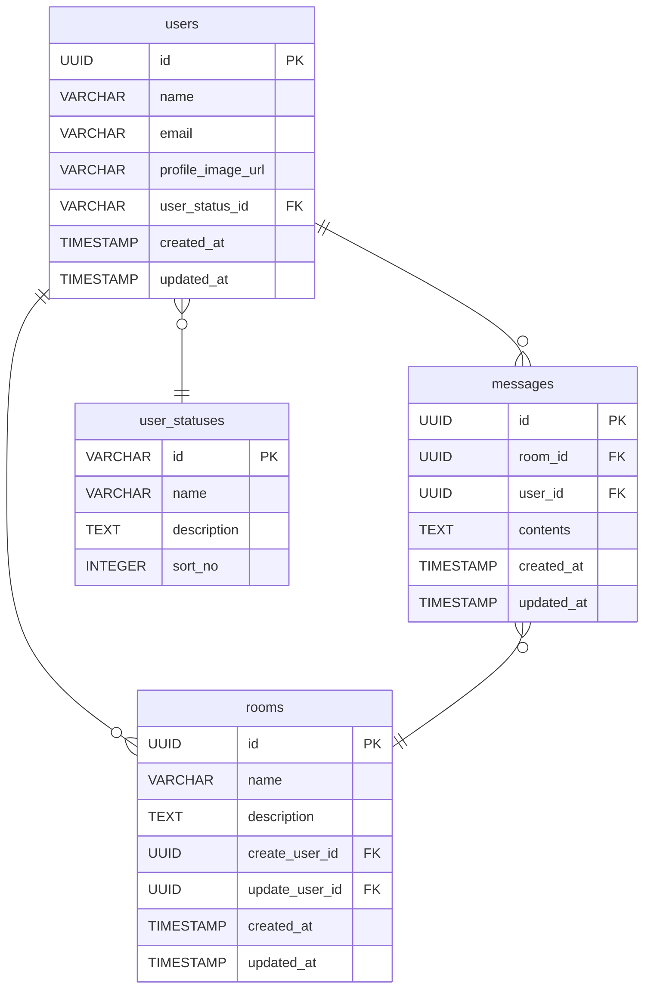

# チャットアプリ データベース設計書

## テーブル定義一覧

| テーブル名    | 論理名             | 用途概要                                   |
| ------------- | ------------------ | ------------------------------------------ |
| users         | ユーザー           | ユーザー情報を管理                         |
| user_statuses | ユーザーステータス | ユーザーステータスのマスタ                 |
| rooms         | チャットルーム     | チャットルームの情報を管理                 |
| messages      | メッセージ         | チャットルームに投稿されたメッセージを管理 |

---

## テーブル定義詳細

### users （ユーザー）

| 論理名                | 項目名            | データ型     | PK  | NN  | 初期値 | 備考                      |
| --------------------- | ----------------- | ------------ | --- | --- | ------ | ------------------------- |
| ユーザー ID           | id                | UUID         | ○   | ○   |        | UUID で自動採番           |
| ユーザー名            | name              | VARCHAR(100) |     | ○   |        |                           |
| メールアドレス        | email             | VARCHAR(255) |     | ○   |        |                           |
| プロフィール画像      | profile_image_url | VARCHAR(255) |     |     |        |                           |
| ユーザーステータス ID | user_status_id    | VARCHAR(50)  | ○   | ○   |        | 外部キー:user_statuses.id |
| 登録日時              | created_at        | TIMESTAMP    |     | ○   | now()  |                           |
| 更新日時              | updated_at        | TIMESTAMP    |     | ○   | now()  |                           |

---

### user_statuses （ユーザーステータス）

| 論理名                | 項目名      | データ型     | PK  | NN  | 初期値 | 備考                   |
| --------------------- | ----------- | ------------ | --- | --- | ------ | ---------------------- |
| ユーザーステータス ID | id          | VARCHAR(50)  | ○   | ○   |        | ACTIVE,WITHDRAWAL など |
| ユーザーステータス名  | name        | VARCHAR(100) |     | ○   |        |                        |
| 説明                  | description | TEXT         |     |     |        |                        |
| 並び順                | sort_no     | INTEGER      |     | ○   | 0      |                        |
| 登録日時              | created_at  | TIMESTAMP    |     | ○   | now()  |                        |
| 更新日時              | updated_at  | TIMESTAMP    |     | ○   | now()  |                        |

---

### rooms （チャットルーム）

| 論理名            | 項目名         | データ型     | PK  | NN  | 初期値 | 備考                                                     |
| ----------------- | -------------- | ------------ | --- | --- | ------ | -------------------------------------------------------- |
| チャットルーム ID | id             | UUID         | ○   | ○   |        | UUID で自動採番                                          |
| チャットルーム名  | name           | VARCHAR(100) |     | ○   |        |                                                          |
| 説明              | description    | TEXT         |     |     |        | チャットルームに関する説明を管理・表示する用のフィールド |
| 作成ユーザー ID   | create_user_id | UUID         |     | ○   |        | 外部キー:users.id                                        |
| 更新ユーザー ID   | update_user_id | UUID         |     | ○   |        | 外部キー:users.id                                        |
| 登録日時          | created_at     | TIMESTAMP    |     | ○   | now()  |                                                          |
| 更新日時          | updated_at     | TIMESTAMP    |     | ○   | now()  |                                                          |

---

### messages （メッセージ）

| 論理名            | 項目名     | データ型  | PK  | NN  | 初期値 | 備考              |
| ----------------- | ---------- | --------- | --- | --- | ------ | ----------------- |
| メッセージ ID     | id         | UUID      | ○   | ○   |        | UUID で自動採番   |
| チャットルーム ID | room_id    | UUID      |     | ○   |        | 外部キー:rooms.id |
| 投稿ユーザー ID   | user_id    | UUID      |     | ○   |        | 外部キー:users.id |
| メッセージ        | contents   | TEXT      |     | ○   |        |                   |
| 登録日時          | created_at | TIMESTAMP |     | ○   | now()  |                   |
| 更新日時          | updated_at | TIMESTAMP |     | ○   | now()  |                   |

---

## インデックス・制約一覧

| テーブル名 | インデックス名                  | カラム                | 種別  | 備考                                             |
| ---------- | ------------------------------- | --------------------- | ----- | ------------------------------------------------ |
| users      | idx_users_email                 | email                 | INDEX | メールアドレスでのユーザー特定の効率化用         |
| messages   | idx_messages_room_id            | room_id               | INDEX | チャットルームのメッセージの絞り込み効率化用     |
| messages   | idx_messages_room_id_created_at | (room_id, created_at) | INDEX | チャットルームごとのメッセージ一覧取得の効率化用 |

---

## ER 図

---

## 補足事項

- ユーザーの退会状態などはユーザーステータス ID で管理する。
- 退会済みのユーザーでも再登録ができるようにするため、email にはユニーク制約はあえて付与していません。アプリ側で制御想定です。
